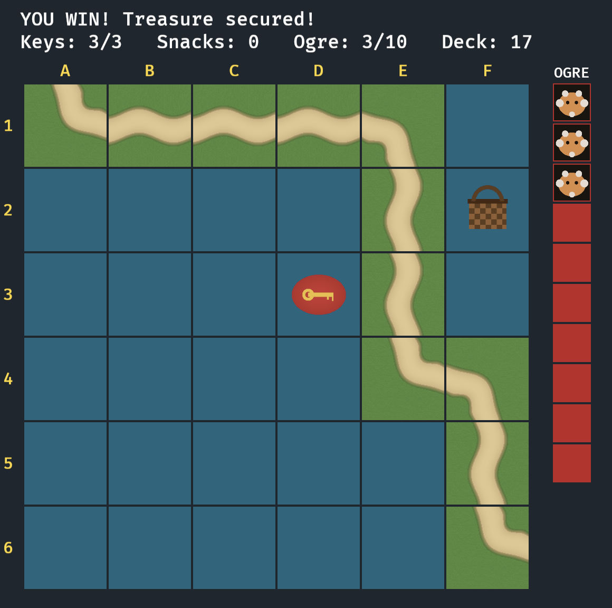

# Race to the Treasure!

A Bevy implementation of the cooperative kids' board game [Race to the Treasure!](https://www.mindware.orientaltrading.com/race-to-the-treasure-peaceable-kingdom-cooperative-board-game-a2-GMC2.fltr?keyword=race%2bto%2bthe%2btreasure) by Peaceable Kingdom.

Beat the Ogre to the treasure by building a continuous path from START to END across a 6×6 grid while collecting 3 keys along the way.



## Run

```
cargo run
```

## Controls

| Key / Click       | Action                                  |
|-------------------|-----------------------------------------|
| `Space`           | Draw a card from the deck               |
| Left mouse button | Place the current path card             |
| `R`               | Rotate the current path card 90°        |
| `1`               | Spend a collected Ogre Snack (removes the most recent ogre card) |
| `Esc`             | Discard an unplayable card              |

## Rules

- **Setup**: 4 keys and 1 ogre snack are placed at random cells. The deck is 27 path cards + 10 ogre cards, shuffled together.
- **Turn**: draw one card. Ogre cards auto-advance the ogre track. Path cards must be placed so at least one of their open ends connects to an existing card's open end (the first card goes on START).
- **Collecting**: covering a key or snack cell with a path card picks it up automatically.
- **Win**: cover the END cell with a path card AND have a continuous path from START to END AND have collected at least 3 keys.
- **Lose**: all 10 ogre cards get placed on the ogre track.

## Notes

All sprites are procedurally generated RGBA textures at startup — no external asset files.
